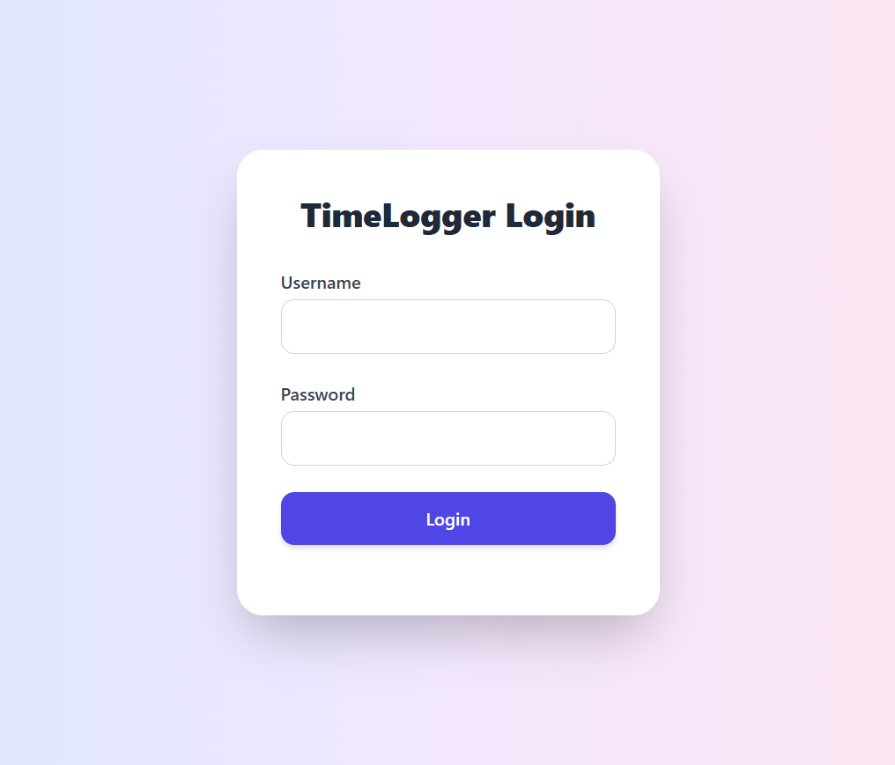
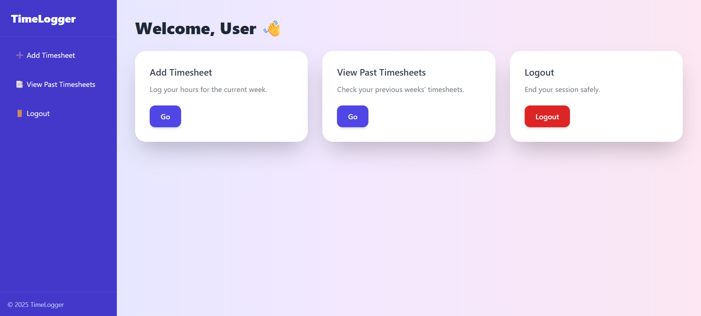
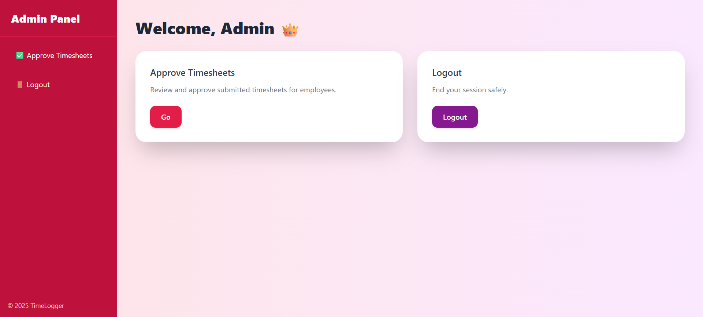

# Timesheet Management Application

A **full-featured Timesheet Management System** built with **Java Servlets, JSP, and SQL**, allowing users to submit and track timesheets and admins to approve or reject them. This project demonstrates a complete workflow of timesheet submission, approval, and modification, with authentication and role-based access.  

---

## Features

### User Features
- ✅ **Submit Timesheets**: Enter daily hours for the week.  
- ✅ **Save Drafts**: Save incomplete timesheets and edit later.  
- ✅ **Modify Rejected Timesheets**: Update hours if admin rejects a submission.  
- ✅ **View Past Timesheets**: Check previous timesheets with status indicators (Approved, Rejected, Submitted).  

### Admin Features
- ✅ **Approve/Reject Timesheets**: Admin can review submitted timesheets.  
- ✅ **View Pending Submissions**: List of all timesheets awaiting approval.  
- ✅ **Role-Based Access**: Only admins can approve/reject timesheets.  

### Technical Features
- **Backend**: Java Servlets, JSP, JDBC  
- **Database**: SQL (MySQL/PostgreSQL compatible)  
- **Authentication**: User login with role-based access (Admin/User)  
- **Frontend**: Tailwind CSS for modern UI  
- **Workflow Management**: Conditional logic for rejected/approved timesheets  

---

## Screenshots

**Login Form**  
  

**User Dashboard**  
  

**Admin Dashboard**  
  

---

## Database Schema

### Users Table
| Column      | Type        | Description                  |
|------------|------------|------------------------------|
| id         | INT        | Primary key                  |
| username   | VARCHAR    | User login                   |
| password   | VARCHAR    | Hashed password              |
| role       | ENUM       | USER / ADMIN                 |

### Timesheets Table
| Column      | Type        | Description                        |
|------------|------------|------------------------------------|
| id         | INT        | Primary key                        |
| mem_id     | INT        | Foreign key referencing Users       |
| wk_start   | DATE       | Week start date                     |
| wk_end     | DATE       | Week end date                       |
| mon, tue, wed, thu, fri, sat, sun | INT | Hours in minutes                  |
| state      | ENUM       | SUBMITTED / APPROVED / REJECTED    |

---

## Getting Started

### Prerequisites
- Java 11+  
- Apache Tomcat 9+  
- SQL Database (MySQL/PostgreSQL)  
- Maven (optional, if building with dependencies)  

### Setup Instructions
1. **Clone the repository**  
```bash
git clone https://github.com/yourusername/timesheet-app.git
```

2. **Configure the Database**  
   - Create a database called `timesheet_db`  
   - Run `schema.sql` to create tables  
   - Update `DBConnection.java` with your DB credentials  

3. **Deploy on Tomcat**  
   - Copy the project to Tomcat `webapps` folder  
   - Start the server and navigate to `http://localhost:8080/timesheet-app`  

4. **Login Credentials (default for testing)**  
   - Admin: `admin / admin123`  
   - User: `user1 / user123`  

---

## Workflow

1. **User submits timesheet** → Status = SUBMITTED  
2. **Admin approves/rejects timesheet** → Status = APPROVED / REJECTED  
3. **Rejected timesheets** → User can modify and resubmit  

---

## Technologies Used
- **Java Servlets & JSP** for backend logic  
- **JDBC** for database interaction  
- **Tailwind CSS** for responsive UI  
- **SQL** (MySQL/PostgreSQL) for persistence  

---

## Future Enhancements
- Add **email notifications** for approvals/rejections  
- Add **export to Excel/PDF** for timesheets  
- Add **pagination** and search for admin timesheet view  
- Implement **session management improvements**  

---

## License
This project is licensed under the MIT License.

